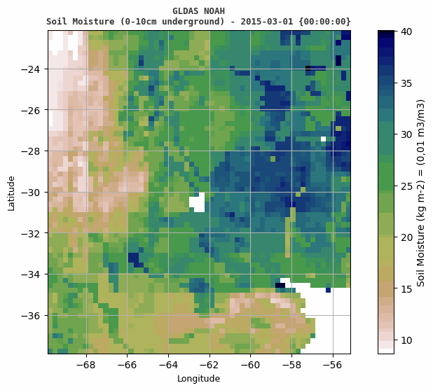
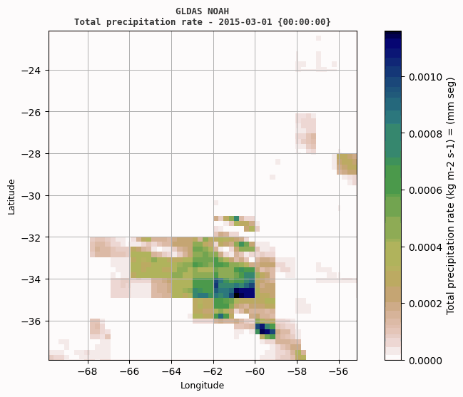
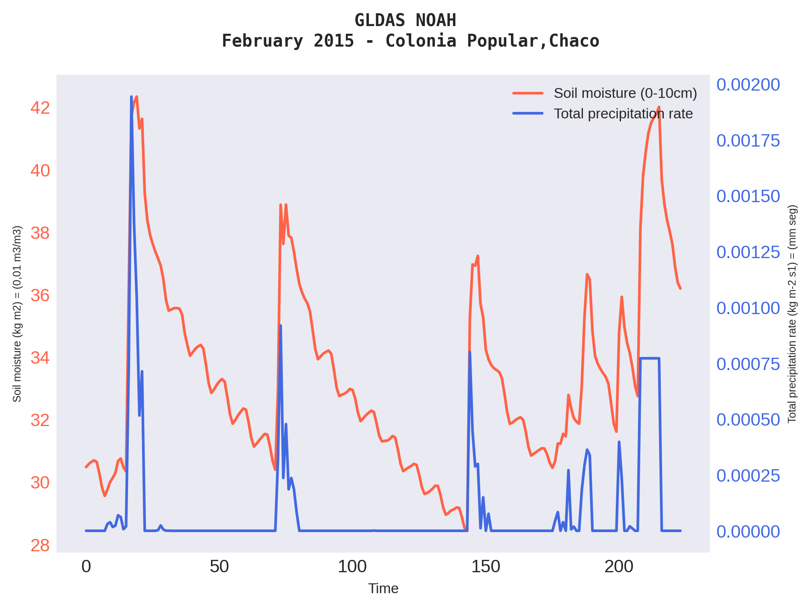
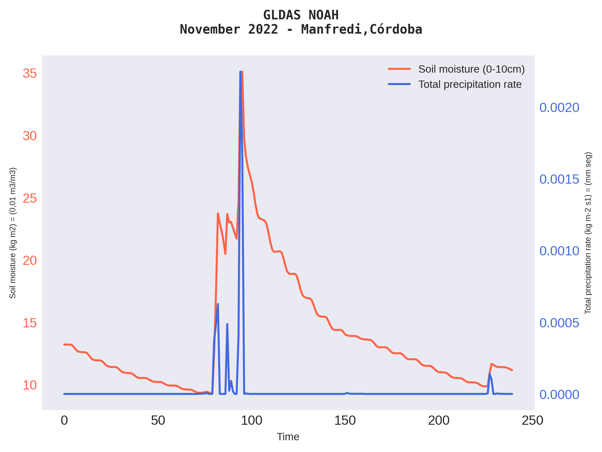
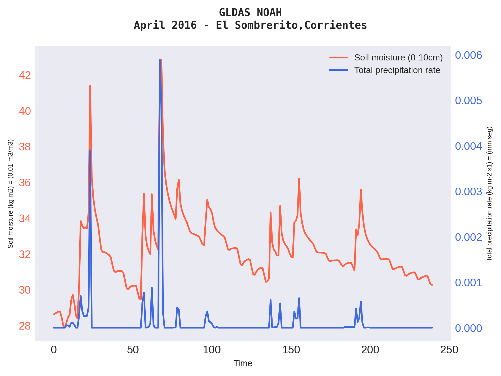

## 🌱 Soil Moisture Project

Data science project of the Atmospheric Science Research Group [(GICA)](http://gica.exa.unne.edu.ar/).

### Stack
`Python` `netCDF4` `Numpy` `Matplotlib` `PIL`

###  Soil moisture and Total precipitation rate in a region

   
  

### Time series for three locations

_Units of measure_

* _Soil Moisture : (kg m2) = (0,01 m3/m3)_
* _Total precipitation rate : (kg m-2 s1) = (mm seg)_
